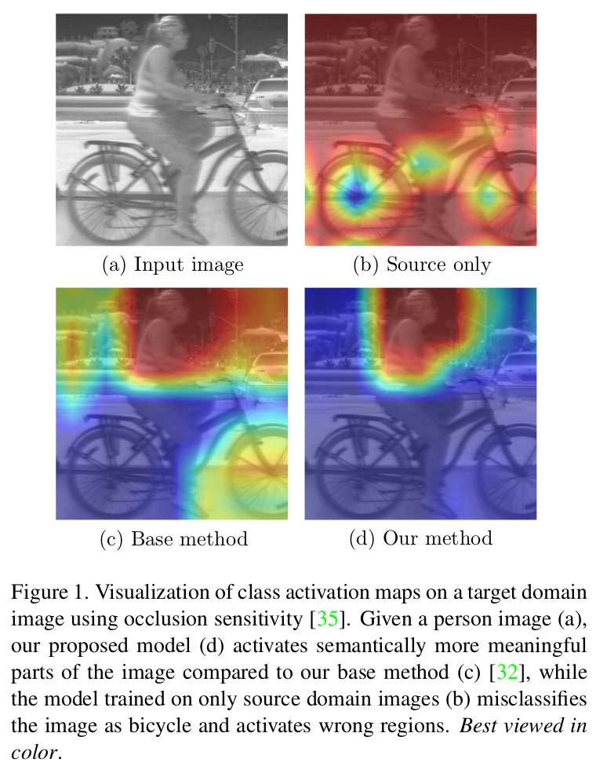

# Self-training Guided Adversarial Domain Adaptation For Thermal Imagery

<p align="center">
  
</p>

If you make use of this code, please cite the following paper:
```
@inproceedings{sgada2021,
  title={Self-training Guided Adversarial Domain Adaptation For Thermal Imagery},
  author={Akkaya, Ibrahim Batuhan and Altinel, Fazil and Halici, Ugur},
  booktitle={Proceedings of the IEEE/CVF Conference on Computer Vision and Pattern Recognition Workshops (CVPRW)},
  year={2021}
}
```

## Overview
This repository contains official implementation of "[Self-training Guided Adversarial Domain Adaptation For Thermal Imagery](https://arxiv.org/abs/1801.07939)" paper (accepted to CVPR 2021 [Perception Beyond the Visible Spectrum (PBVS)](https://pbvs-workshop.github.io/) workshop).


## Environment
- Python 3.8.5
- PyTorch 1.6.0

To install the environment using Conda:
```
$ conda env create -f requirements_conda.yml
```

This command creates a Conda environment named `sgada`. The environment includes all necessary packages for training of SGADA method. After installation of the environment, activate it using the command below:
```
$ conda activate sgada
```

### Note
Before running the training code, make sure that `DATASETDIR` environment variable is set to your dataset directory.
## Acknowledgement
This repo is mostly based on:
- https://github.com/Fujiki-Nakamura/ADDA.PyTorch
- https://github.com/fazilaltinel/ADDA.PyTorch-resnet
