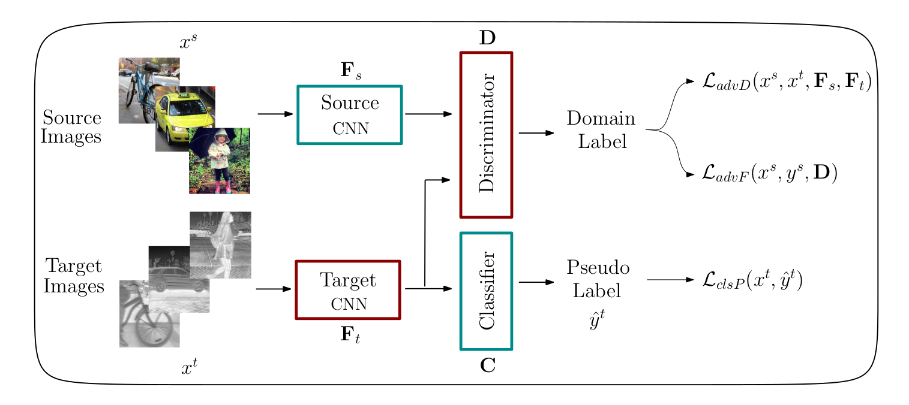

# Self-training Guided Adversarial Domain Adaptation For Thermal Imagery

<p align="center">
  
</p>

If you make use of this code, please cite the following paper (and give us a star :sparkles:):
```bibtex
@inproceedings{sgada2021,
  title={Self-training Guided Adversarial Domain Adaptation For Thermal Imagery},
  author={Akkaya, Ibrahim Batuhan and Altinel, Fazil and Halici, Ugur},
  booktitle={Proceedings of the IEEE/CVF Conference on Computer Vision and Pattern Recognition Workshops (CVPRW)},
  year={2021}
}
```

[](https://arxiv.org/abs/1801.07939) [](https://avaapm.github.io/sgada/)

## Overview
This repository contains official implementation of "[Self-training Guided Adversarial Domain Adaptation For Thermal Imagery](https://arxiv.org/abs/1801.07939)" paper (accepted to CVPR 2021 [Perception Beyond the Visible Spectrum (PBVS)](https://pbvs-workshop.github.io/) workshop).

<p align="center">
  
</p>

## Environment
- Python 3.8.5
- PyTorch 1.6.0

To install the environment using Conda:
```bash
$ conda env create -f requirements_conda.yml
```

This command creates a Conda environment named `sgada`. The environment includes all necessary packages for training of SGADA method. After installation of the environment, activate it using the command below:
```bash
$ conda activate sgada
```

#### Note
Before running the training code, make sure that `DATASETDIR` environment variable is set to your dataset directory.
```bash
$ export DATASETDIR="/path/to/dataset/dir"
```

## Dataset Preparation
- Download FLIR ADAS dataset: [Link](https://www.flir.eu/oem/adas/adas-dataset-form/)
- Download MS-COCO dataset: 
  - [Train images](http://images.cocodataset.org/zips/train2017.zip) 
  - [Val images](http://images.cocodataset.org/zips/val2017.zip) 
  - [Train/Val annotations](http://images.cocodataset.org/annotations/annotations_trainval2017.zip)
- After you downloaded the datasets, extract them to `DATASETDIR`.
- Crop annotated objects (for bicycle, car and person classes only) using the command below:
```bash
(sgada) $ python utils/prepare_dataset.py
```
After the preparation steps, your dataset folder should be in the following structure.
```
DATASETDIR
└── sgada_data
    ├── flir
    │   ├── train
    │   │   ├── bicycle
    │   │   ├── car
    │   │   └── person
    │   ├── val
    │   │   ├── bicycle
    │   │   ├── car
    │   │   └── person
    │   ├── test_wconf_wdomain_weights.txt
    │   └── validation_wconf_wdomain_weights.txt
    └── mscoco
        ├── train
        │   ├── bicycle
        │   ├── car
        │   └── person
        └── val
            ├── bicycle
            ├── car
            └── person
```

`test_wconf_wdomain_weights.txt` and `validation_wconf_wdomain_weights.txt` files can be found [here](/files). Place them under `DATASETDIR/sgada_data/flir/`. These files have the fields below. 
```
filePath, classifierPrediction, classifierConfidence, discriminatorPrediction, discriminatorConfidence, sampleWeight
```
If you want to generate pseudo-labelling files by yourself, your pseudo-labelling files should follow the given order. In order to obtain confidences and predictions, you can follow the training scheme in [ADDA.PyTorch-resnet](https://github.com/fazilaltinel/ADDA.PyTorch-resnet).

## Running
1. `[Optional]` Follow the source only training scheme in [ADDA.PyTorch-resnet](https://github.com/fazilaltinel/ADDA.PyTorch-resnet) and save the model file.
   * If you want to use this source only model file, skip to the Step 4.
2. Download the model file trained on source only dataset. [Link](https://drive.google.com/file/d/1WY0MW2Xonwky0sY1pcaQQ2AA9bJ5eP-b/view?usp=sharing)
3. Extract the compressed file.
4. To train SGADA, run the command below.
```bash
(sgada) $ python core/sgada_domain.py \
 --trained [PATH] \
 --lr [LR] --d_lr [D_LR] --batch_size [BS] \
 --lam [LAM] --thr [THR] --thr_domain [THR_DOMAIN] \
 --device cuda:[GPU_ID]
```

| Parameter Name  | Type | Definition  |
| :-------------- | :--- | :---------- |
| `[PATH]` | `str` | Path to the source only model file generated in Step 1 or downloaded in Step 2 |
| `[LR]` | `float` | Learning rate |
| `[D_LR]`| `float`  | Discriminator learning rate |
| `[BS]`| `int`  | Batch size |
| `[LAM]`| `float`  | Trade-off parameter |
| `[THR]`| `float`  | Classifier threshold|
| `[THR_DOMAIN]`| `float`  | Discriminator threshold|
| `[GPU_ID]`| `int`  | GPU device ID |

#### Example running command 
```bash
(sgada) $ python core/sgada_domain.py \
 --trained /mnt/sgada_model_files/best_model.pt \
 --lr 1e-5 --d_lr 1e-3 --batch_size 32 \
 --lam 0.25 --thr 0.79 --thr_domain 0.87 \
 --device cuda:3
```
## Acknowledgement
This repo is mostly based on:
- https://github.com/Fujiki-Nakamura/ADDA.PyTorch
- https://github.com/fazilaltinel/ADDA.PyTorch-resnet
